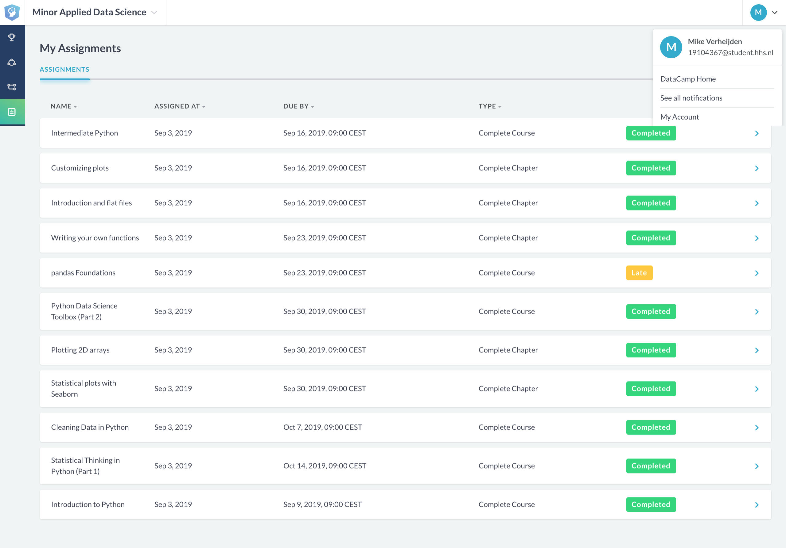

# Portfolio -- minor KB-74 'Applied Data Science'

This is the reader's guide for student Mike Verheijden (19104367), currently studying the minor 'Applied Data Science' at The Hague University Of Applied Science (THUAS), for the personal portfolio for the final grading to successfully complete this minor.

## Research project

### Task definition

The reason for this project 'TITANIUM' is that the European Union, in collaboration with various organizations like TNO, want to gain insight into what is happening on various dark web forums and marketplaces. TNO tasked us to create a topic classifier that takes dark web text as input, and gives the topic that is being talked about as output. This way they can view what topics are being talked about, pick up on trending topics, etc. From this reasoning and problem, we formulated a main research question that goes as follows:

<pre>
How can a pipeline be created that classifies dark web text-based content to a predetermined topics list?
</pre>

From this main question, multiple subquestions were made in order to split it into different domains that could be researched individually. My contributions are attached to each question.

- *How are the dark web forums / markets structured?*

Researching papers about the dark web markets and forums (as seen in literature list in section *Literature Research*), exploring the dark web itself in order to see this for myself.

- *What labels of the dataset provided by TNO are relevant for the research?*

We briefly researched what the structure of the dataset during the meetings at TNO.

- *What strategies can be used to preprocess the available data?*

Researching on internet what preprocess methods are available, trying to understand what their underlying technique/formulas are and how they fit within the project.

- *What feature extraction methods are available for text classification?*

Researching on various articles and following tutorials.

- *What machine learning algorithms can be used for natural language processing?*

Again researching various articles online, reading and reviewing code, much trial and error to figure out how these methods work and what efficient is.

- *What preprocessing method works best on the dark web text content?*

This was mainly done by the rest using Dennis' script.

- *What feature extraction methods give the best vectorization of the text content?*

Trying out locally for myself on the Agora data.

- *What machine learning algorithms give the best result?*

Trying out various algorithms and evaluating their scores. Also learned and tried out another way of splitting train and test sets.

- *What combination of processing, feature extraction and machine learning algorithms gives the best pipeline?*

Adding the k-fold cross validation to the pipelin, resulting in an increase of performance.

- *How can unsupervised machine learning be applied for the validation of the classifier?*

I found articles online and tried out some algorithms in the very beginning of the project, but came to the conclusion that this was not yet efficient to work at that point in time. Other members tried it aswell at a later stadium in the project.

### Evaluation

The core of our project was to create a pipeline that classifies contents based on a topics list. We succeeded at this, but not up to the point that was mentioned during the first meetings.

This means that this project is not fully completed in my opinion, since TNO asked us to make a classifier that takes input from both advertisements **and forum posts**. The reason for this however is not our fault, since we mailed them multiple times about this matter and they never came back to it. TNO also made clear that an accuracy of 95% would suffice in their opinion, however with the current data that is available from WebIQ, this is not very likely. Finally, not all topics of the provided list could be classified, simply because there is not enough variance in the data to train on.

For future work, I would recommend to look deeper into unsupervised learning in order to detect topics and ways to expand the dataset so that a model can be trained more efficiently and effectively. Looking and analyzing the forumposts is also a recommendation, so that this may also be included in the dataset for training the model.

### Conclusions

Referring back to the main question of the project, the results (matrix [Agora](img\comparison_Agora.png)/[WebIQ](img\comparison_WebIQ.png)) show that using minimal text alteration gives the best scores using an tf-idf vectorization approach with applying n-grams. This data is then given to a Linear SVC algorithm, which comes down to a F1-score of 87 on the WebIQ set, which is the highest we could achieve during the project.

### Research planning

The research is planned in a agile/SCRUM fashion, meaning that sprints are defined for periods of two weeks in order to safeguard progress, deadlines and deliverables. The [detailed researchplanning](https://docs.google.com/spreadsheets/d/1vaSoA5Cp66wbBTGdaLRTS3dO9KKMIrv8_TaI7geka7E/edit?usp=sharing) shows that before the project started, multiple tasks for the project were defined, noted and assigned to certain weeks in which these tasks would be executed. The visualization of this planning was done by me and Dennis van Gilst, using a template I created for my previous internship.

The project was safeguarded using an online Trello board, where various tasks are defined and each individual project member keeps tracks of their respective tasks.

Since the board is very big, I will summarize some examples of the tasks that I picked up during the project:

| Sprint1   | Sprint2  | Sprint3    | Sprint4   |
|-----------|----------|------------|-----------|
| Write plan of action    | Write researchplan  | Experiment Tensorflow | Open presentation  |
| Domain research dark web   | Defining projectscope | Researching ML models | Word2vec logistic regression classifier |
| Domain research preprocessing | Adjust subquestions   |               | Closed presentation |

&nbsp;

| Sprint5 | Sprint6 | Sprint7 | Sprint8 |
|---------|---------|---------|---------|
| Training ML models | Try k-fold | Setting up LaTeX | Wrapping up paper |
| Research spectral clustering | Find out how to validate  unsupervised learning | Convert Google doc to LaTeX | Wrapping up portfolio |
| Evaluating scores |  | Plotting Hold-out vs k-fold |  |

## Domain knowledge

### Introduction of the subject field

The 'dark web' is a collection of various websites that exist on an encrypted network that cannot be indexed using traditional search engines or browsers (Senker, 2017). The dark web provides its users complete anonimity because of the 'Tor network', provided with its own browser granting access to the dark web for everybody, making it easily accessible and rather risk-free for illegal activities. Because this hosts a large amount of illegal activities, both Interpol and multiple international police departments are very interested in gaining more insight in order to combat these cybercriminals. The research will focus on using natural language processing (NLP) in combination with machine learning to provide these insights in the form of certain predetermined topics (Koenig, 2019). NLP is the domain of processing text to binary data in order for a machine learning model to understand meaning and context. Feeding the data to the model will be in the form of various market advertisements and forum posts in order to classify what the topic(s) is/are that are discussed in said texts.

### Literature research

Within the project, I conducted a lot of research in order to obtain knowledge about the domain of the dark web, natural language processing, but also about data science itself since this is a new domain of knowledge for me. This resulted in a lot of deskresearch, scouring the internet for information about all these subjects and reading papers. Luckily I had some previous experience with the dark web when casually exploring it in my free time.

Also, a lot of information that was gathered by myself is provided by the website *[Medium/Towards Data Science](https://towardsdatascience.com/)*, since this contains various smaller articles/tutorials on the subjects I was researching and this reading this was faster than reading long papers.

#### Bibliography

Below is a brief bibliography of the literature (papers and articles) I found would help by understanding the various subjects of the project for myself:

- Allibhai, E. (2019, August 3). Holdout vs. Cross-validation in Machine Learning. Retrieved November 23, 2019, from https://medium.com/@eijaz/holdout-vs-cross-validation-in-machine-learning-7637112d3f8f
- Chakure, A. (2019, June 29). Data Preprocessing in Python. Retrieved September 26, 2019, from https://towardsdatascience.com/data-preprocessing-3cd01eefd438
- Chen, H. (2012). Dark Web. *Integrated Series in Information Systems*. https://doi.org/10.1007/978-1-4614-1557-2
- Fleshman, W. (2019, February 21). Spectral Clustering. Retrieved October 23, 2019, from https://towardsdatascience.com/spectral-clustering-aba2640c0d5b
- Koenig, R. (2019, July 29). NLP for Beginners: Cleaning & Preprocessing Text Data. Retrieved September 26, 2019, from https://towardsdatascience.com/nlp-for-beginners-cleaning-preprocessing-text-data-ae8e306bef0f
- Li, S. (2019, February 19). Multi-Class Text Classification with Scikit-Learn. Retrieved October 15, 2019, from https://towardsdatascience.com/multi-class-text-classification-with-scikit-learn-12f1e60e0a9f
- Pannu, M., Kay, I., & Harris, D. (2018). Using Dark Web Crawler to Uncover Suspicious and Malicious Websites. *Advances in Intelligent Systems and Computing*, 108–115. https://doi.org/10.1007/978-3-319-94782-2_11
- Ray, S. (2019, September 4). Improve Your Model Performance using Cross Validation (in Python and R). Retrieved November 22, 2019, from https://www.analyticsvidhya.com/blog/2018/05/improve-model-performance-cross-validation-in-python-r/
- Senker, C. (2017). *Cybercrime and the Darknet: Revealing the Hidden Underworld of the Internet*. London: Arcturus Publishing Limited.
- Zamani, M., Rabbani, F., Horicsányi, A., Zafeiris, A., & Vicsek, T. (2019). Differences in structure and dynamics of networks retrieved from dark and public web forums. *Physica A: Statistical Mechanics and its Applications, 525*, 326–336. https://doi.org/10.1016/j.physa.2019.03.048

### Terms, jargon and definitions

For the different terms, jargon and definitions, I made a terminology list for our shared [Google Drive](https://docs.google.com/document/d/1_PiH3GpbucwgJX_mEqwgqkKT412Pzws2v5Pz95TKNsY/edit?usp=sharing) in order to maintain clearness on what the different terms within our field of subject mean. This list is also used to note down other terms found online and within the lectures in order for the project group to have a full understanding of all terms for both the domains of the project and data science itself.

## Predictive analysis

### Selecting a Model

The selection of a model was done by using a [comparison matrix](img\comparison_Agora.png) made by Christian that showed the results of all algorithms with all the different preprocess methods we defined used on the Agora set.

### Configuring a Model

...

### Training a model

...

### Evaluating a model

When searching the internet I stumbled upon another way to split data in order to train on it in comparison to the normal method used by Sklearn, using the strategy of k-fold cross validation (Allibhai, 2019).

For the WebIQ dataset, I took the tf-idf vectors and trained multiple models with these with both hold-out and k-fold validation. This resulted in minor improvements on the scores of approximately one percent. While this is not much, small improvements like this eventually could add up and to reach higher scores. Refer to the specific notebooks to see these results, [notebook - Hold-out WebIQ](notebooks/TNO_Holdout_tfidf.ipynb), [notebook - k-fold WebIQ](notebooks/TNO_K-fold_tfidf.ipynb) and [notebook - comparison WebIQ](notebooks\TNO_tfidf_set_comparison.ipynb).

### Visualizing the outcome of a model (explanatory)

...

## Data preprocessing

Each Jupyter notebook will be titled according to what dataset it contains, e.g. 'Agora' or 'WebIQ'. The Agora dataset is the one that is publicly available on [Kaggle](https://www.kaggle.com/philipjames11/dark-net-marketplace-drug-data-agora-20142015), and the WebIQ dataset is the dataset provided by WebIQ which cannot be published, because of privacy sensitive data, for which a data agreement is signed aswell.

### Data exploration

Before any of us could work on the retrieved data, it was necessary to explore the data in order to see what we were going to work with.

First of all, I explored the Agora dataset, mainly searching for outliers, analyzing the structure (columns, rows, etc.), visualizing the spread of the different categories, etc. This was done to get familiar with the data. For the exploration of the Agora dataset, refer to [notebook - Agora Data Exploration](notebooks/Agora_Data_Exploration.ipynb).

I quickly came to the conclusion that the Agora dataset is a very long dataset (columns) and that it is also heavily biased towards *drugs* as it takes up 89,3% of the total dataset, so that we needed to take that into account. We also found out that the records are not very long in characters, maxed around 250 characters.

After retrieving the WebIQ data from TNO, that needed to be explored in the same way as the Agora dataset, even though this was vectorized data. For the exploration of the WebIQ dataset, refer to [notebook - WebIQ Data Exploration](notebooks/TNO_Data_exploration.ipynb).

After analyzing the data, we found multiple errors in the script that needed to be fixed. This set was also very small (+/- 11.500 records), but the data was very long and qualitatively better. The dataset consisted of only categories and vectorized words. We also noted that these categories did not match the Interpol topics list, so we needed to map these.

### Data cleansing

The data exploration of the Agora set showed that there were multiple (four, to be exact) records that were incorrect, possibly due to parsing errors. It was necessary to clean this in order to get a clean set with only *real* categories so that models could be trained without errors. The data cleansing is done is [notebook - Agora Data Cleansing](notebooks/Agora_Data_Cleaning.ipynb).

The WebIQ data did not need to cleansed, since these were vectorized by our own script.

### Data preparation

As shown in the paragraph below, any outliers were removed from the dataset, leaving me to look into different methods of preprocessing the data.
The data preprocessing steps are looked into are lemmatization, stemming, unicode, lower. This is done using Dennis van Oosten's preprocess script for the project.

For the vectorization, I practised a little bit with various methods in order to get the hang of it for myself. For the notebook, refer to [notebook - Agora Vectorization](notebooks/Agora_Vectorization_Practise.ipynb).

### Data explanation

The Agora dataset is a .csv-file containing 109.590 records of advertisements that were placed on the now-closed Agora marketplace. Every advertisement has a *vendor, category, item + description, price, etc*. Also, I calculated the percentage of each category within the dataset and added this to the codebook using my data exploration script. For a detailed overview of how this dataset is structured, refer to the codebook that was written by Dennis van Gilst -- [codebook Agora](https://docs.google.com/spreadsheets/d/1gN1_2B79F_eKS_axDTHM5dBmgCnCSXjKqo3MmujwT8Y/edit?usp=sharing).

The WebIQ dataset, however, is very different. This dataset consisted of several .pkl-files (pickle files) that had to manually be combined within a notebook. This was we had made several preprocessing methods that each returned its own vectors, meanwhile the categories stayed the same. I also initiated within the group to write a codebook for this dataset and calculated the category percentages again. For a detailed overview of how this dataset is structured, refer to the codebook that was written by the group as a whole for the WebIQ dataset -- [codebook WebIQ](https://docs.google.com/spreadsheets/d/1LHR3e9M0y2_Mld7AG_zhMe56IACZKwa5RfGsT4eDLW4/edit?usp=sharing).

### Data visualization (exploratory)

I tried visualizing the tf-idf vectors of the balanced Agora set using Dennis' preprocess script, in order to see whether any clusters were formed. Unfortunately, this result was....

## Communications

Multiple presentations needed to be performed by each individual project member in order to score on the rubric. This means the weekly closed presentations on Monday and the four-weekly open presentations on Friday. The following dates show when I presented:

| Date       | Week   | Kind   | Subject |
|------------|:------:|:----------------------------------:|---------|
| 14-10-2019 | 7      | [Closed](https://docs.google.com/presentation/d/18pM7pRmxdsDqRGJz84PMqaN9kibJh_S50wNqZksWjyg/edit?usp=sharing) | Visualizations (T-SNE, UMAP, confusion matrix) |
| 01-11-2019 | 8      | [Open](https://drive.google.com/file/d/139Ulhyow2SwwF6IoJqTZhCDblRnP2JMU/view?usp=sharing) | Project as a whole, created dataframes, pipelines, train results |
| 18-11-2019 | 11     | [Closed](https://docs.google.com/presentation/d/1YNo-k7I8A9M9UAcpv9xqzkEaW38lNg3lu-9FoTFDubg/edit?usp=sharing) | Ensemble learning, RNN, problem status dataset |
| 10-01-2020 | 13     | [Open](https://drive.google.com/file/d/181d7qLdFrMkpcqN7AoUJOiJLNOWKkO65/view?usp=sharing) | Project as a whole, preprocess strategy + scores, pipeline, Docker    |
| 23-01-2020 | 16     | [Symposium](about:blank) | Final open posterpresentation  |

Finally, the [research paper](docs/researchpaper.pdf) is also included as the final delivarable for this minor. The project group wrote the paper together and contributed evenly towards it. Specifically, my contributions to the paper will be noted down below and consist of the following elements:

- Getting familiar with LaTeX in order to explain this to the rest of the group and also setting up a LaTeX environment for the whole group to work collaboratively online.
- Setting up the template of the file in order to safeguard that all criteria from the different documents that are published on Blackboard were met (e.g. using LNCS-format, structure of the paper, paragraphs, etc.).
- Contributing to the following paragraphs:
  - Abstract,
  - Introduction,
  - Methodology,
  - Pipeline,
  - Machine learning,
  - Results,
  - Conclusion,
  - Discussion
- Searching and referencing papers / documents using BibTeX.
- Frequently checking and improving various elements within the paper, e.g. spelling, punctuation, grammar, consistency, correct references to appendices/figures/sources and frequently wrong spelled words.

## Obligatory criteria

As shown on my [Datacamp profile](https://www.datacamp.com/profile/19104367), all required courses that needed to be completed are done.

Another criteria that is required for the portfolio is writing multiple reflections in order to reflect and evaluate my contributions towards the project, my own learning objectives for this minor and finally the project as a whole. The individual reflections are found in the following links:

- [Reflection on contribution](docs/reflection_contribution.md)
- [Reflection on own learning objectives](docs/reflection_objectives.md)
- [Evaluation on group project as a whole](docs/evaluation_group.md)
