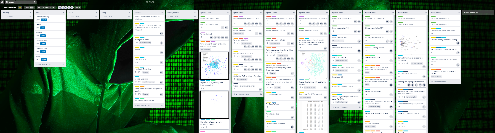

# Portfolio Mike Verheijden -- minor Applied Data Science

This is the reader's guide for student Mike Verheijden (19104367), currently studying the minor 'Applied Data Science' at The Hague University Of Applied Science (THUAS), for the personal portfolio for the final grading to successfully complete this minor.

Each Jupyter notebook will be titled according to what dataset it contains, e.g. 'Agora' or 'Darknet Markets'. The Agora dataset is the one that is publicly available on [Kaggle](https://www.kaggle.com/philipjames11/dark-net-marketplace-drug-data-agora-20142015), and the Darknet Markets dataset is the dataset provided by WebIQ which cannot be published, because of privacy sensitive data, for which a data agreement is signed aswell. For all notebooks containing the Darknet Markets data, the code will be noted as comments as it is not possible to show any results as stated in the data agreement. However, this way it is still possible to look at what code is written in order to obtain said results.

## Domain knowledge

asdasdaoskda

## Data preprocessing

The data preprocessing steps that are used

## Research project

task definition (context,reason and problem definition, research questions)

evaluation

The research is planned in a agile/SCRUM fashion, meaning that sprints are defined for periods of two weeks in order to safeguard progress, deadlines and deliverables. The [detailed researchplanning](https://docs.google.com/spreadsheets/d/1vaSoA5Cp66wbBTGdaLRTS3dO9KKMIrv8_TaI7geka7E/edit?usp=sharing) shows that before the project started, multiple tasks for the project were defined, noted and assigned to certain weeks in which these tasks would be executed. The project was safeguarded using an online Trello board, where various tasks are defined and each individual project member keeps tracks of their respective tasks.

Conclusions

## Predictive analysis

asdasdaoskda

Link to [Logistic Regression Classifier](LogisticRegressionClassifier.ipynb)

## Communications

Multiple presentations needed to be performed by each individual project member in order to score on the rubric. This means the weekly presentations on Monday, where progress and problems are presented in order to discuss possible solutions with the whole class. And also the four-weekly presentations on Friday, where the whole progress of the project is presented and where people from outside of THUAS are also allowed to attend and ask questions. The following dates show when I presented:

| Date       | Week   | Day                                                                                                            | Subject |
|------------|:------:|----------------------------------------------------------------------------------------------------------------|---------|
| 14-10-2019 | 7      | [Monday](https://docs.google.com/presentation/d/18pM7pRmxdsDqRGJz84PMqaN9kibJh_S50wNqZksWjyg/edit?usp=sharing) | Visualizations (T-SNE, UMAP, confusion matrix) |
| 01-11-2019 | 8      | [Friday](https://drive.google.com/file/d/139Ulhyow2SwwF6IoJqTZhCDblRnP2JMU/view?usp=sharing) | Project as a whole, created dataframes, pipelines, train results |
| 18-11-2019 | 11     | [Monday](https://docs.google.com/presentation/d/1YNo-k7I8A9M9UAcpv9xqzkEaW38lNg3lu-9FoTFDubg/edit?usp=sharing) | Ensemble learning, RNN, problem status dataset |
| 10-01-2020 | 13     | [Friday](https://drive.google.com/file/d/181d7qLdFrMkpcqN7AoUJOiJLNOWKkO65/view?usp=sharing) | Project as a whole, T-SNE, preprocess strategy + scores    |
| 23-01-2020 | 15     | [Symposium](about:blank) | Final open posterpresentation   |

Finally, the [research paper](about:blank) is also included and my efforts on the paper will be noted down aswell.

## Obligatory criteria

As shown on my [Datacamp profile](https://www.datacamp.com/profile/19104367), all required courses that needed to be completed are done.

Another criteria that is required for the portfolio is writing multiple reflections in order to reflect and evaluate the project and my learning objectives. The individual reflections are found in the following links:

* [Reflection on contribution](documents/reflection_contribution.md)
* [Reflection on own learning objectives](documents/reflection_objectives.md)
* [Evaluation on group project as a whole](documents/evaluation_group.md)
